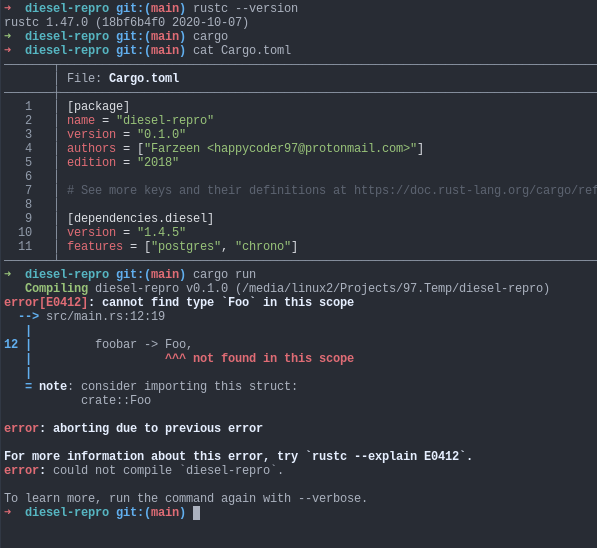

## Code
```rust
#[macro_use]
extern crate diesel;

struct Foo;

table! {
    use diesel::sql_types::*;
    use super::Foo;

    test_table {
        id -> Integer,
        foobar -> Foo,
    }
}

fn main() {
    println!("Hello, world!");
}
```

### Problem

`table!` macro doesn't copy imports section to generated code.

[cargo expand output](expanded.rs)

### Screenshot of error message




